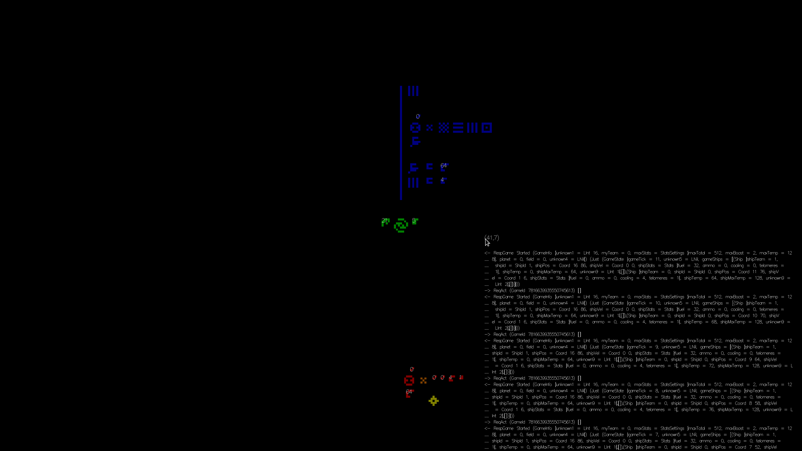

ICFP Contest 2020 Team powder
=============================

Repository structure
--------------------

The repository contains 3 packages:
```
                    common/
            icfpc2020-powder-common
             ^                    ^
             |                    |
        target/                   meta/
icfpc2020-powder-target   icfpc2020-powder-meta
```
`target` is the code that is intended to be run as the submission, `meta` is the various tools that we run on our machines, and `common` is anything that is useful in both. To build them all run `stack build` or `stack install` (`build.sh` would only build the target). There is also the `data/` directory containing all the recorded transmissions.

The files are, in roughly chronological order:

- `meta/Modem.hs` -- utilities for modulating/demodulating signals encoded as sound
  - `decode` (`meta/app/Decode.hs`) -- decode a sound signal (WAV on stdin, ASCII on stdout)
  - `encode` (`meta/app/Encode.hs`) -- encode a sound signal (text on stdin, PCM on stdout)
  - `behead.sh` -- WAV to PCM
  - `wav.sh` -- PCM to WAV
  - `cleanse` (`meta/app/Cleanse.hs`) -- remove the modulated signal, leaving just the noise
- `meta/Blocks.hs` -- utilites for decoding symbols from 2D arrays of pixels
- `meta/Calculus.hs` -- a generic lambda/combinatory calculus with a customizable rewriting rule engine
- `meta/Language.hs` -- definitions of the types of alien blocks, and their rewrite rules
- `meta/translate_txt/translate.hs` -- translate strings from "Pegovka text" format into our internal format
- `meta/VM.hs` -- an imperative implementation of an eval/apply machine, with some of the "builtin" functions used by the alien language
- `meta/Eval.hs` -- a parser/compiler for the `VM`
  - `prelude.txt` -- definitions for some of the auxiliary terms used by the alien language
  - `run` (`meta/app/Run.hs`) -- alien REPL
  - `meta/gui.cpp` -- an attempt at an SDL GUI frontend to `Eval`
  - `interact` (`meta/app/Interact.hs`) -- a Gloss GUI for interacting with the galaxy
- `common/Common.hs` -- squiggly encoding routines
- `meta/Alien/Galaxy.hs` -- **the galaxy directly translated into Haskell, using the GHC RTS as a makeshift eval/apply implementation**
- `meta/Alien/Prelude.hs` -- definitions for the basic combinators used by the alien code
- `meta/Alien/FFI.hs` -- utilities for poking the GHC RTS to interoperate with the alien code correctly
  - `hsinteract` (`meta/app/HsInteract.hs`) -- **a Gloss GUI, with way more features, using the Haskell-compiled version of the galaxy**
- `common/Protocol.hs` -- a reverse-engineering of the alien satellite protocol
- `main` (`target/Main.hs`) -- **the main program that was our submission**
- `common/Simulation.hs` -- an attempt at an AI that can correct its orbit
- `common/AI/Orbital.hs` -- another attempt at an AI that can: adjust its orbit to both not hit the planet and stay within the bounding box; shoot enemies, but only when the hit is going to be "good"; fork and separate into a debris field

HsInteract
==========


*(A tutorial level being played in HsInteract)*

The program launches a fullscreen Gloss GUI that displays the images produced by the galaxy, with layers rendered in different colors, and sends clicks back to the galaxy. The program does a generous amount of logging regarding the state of the galaxy and requests to the alien satellite.

The program deviates from the spec in that it *first* prompts the user for a click. This is necessary in case we "resume" from a state that is not the initial state (see below).

Inside the GUI there are a few keybindings:

- `<Up>` -- zoom in
- `<Down>` -- zoom out
- `s` -- toggle showing state under the cursor
- `l` -- toggle showing alien satellite request log under cursor
- `n` -- toggle number block parsing overlay
- `i` -- input coordinates for click from stdin
- `w` -- make text bigger
- `q` -- make text smaller

The program optionally accepts an initial state in argv[1], specified as a "short list" string: `[A,...,Z]` for `ap ap cons A ... ap ap cons Z nil` and `(A,...,Z)` for `ap ap cons A ... Z`. See examples in the stdout of the program.

Alien.Galaxy
============

We found the idea of compiling galaxy to haskell interesting enough that we polished/published it into a [separate repository](https://github.com/mniip/icfpc2020-galaxy) and even uploaded onto [hackage](https://hackage.haskell.org/package/icfpc2020-galaxy)!

Writeup
=======

TODO
