ICFP Contest 2020 Team powder
=============================

Repository structure
--------------------

The repository contains 3 packages:
```
                    common/
            icfpc2020-powder-common
             ^                    ^
             |                    |
        target/                   meta/
icfpc2020-powder-target   icfpc2020-powder-meta
```
`target` is the code that is intended to be run as the submission, `meta` is the various tools that we run on our machines, and `common` is anything that is useful in both. To build them all run `stack build` or `stack install` (`build.sh` would only build the target). There is also the `data/` directory containing all the recorded transmissions.

The files are, in roughly chronological order:

- `meta/Modem.hs` -- utilities for modulating/demodulating signals encoded as sound
  - `decode` (`meta/app/Decode.hs`) -- decode a sound signal (WAV on stdin, ASCII on stdout)
  - `encode` (`meta/app/Encode.hs`) -- encode a sound signal (text on stdin, PCM on stdout)
  - `behead.sh` -- WAV to PCM
  - `wav.sh` -- PCM to WAV
  - `cleanse` (`meta/app/Cleanse.hs`) -- remove the modulated signal, leaving just the noise
- `meta/Blocks.hs` -- utilites for decoding symbols from 2D arrays of pixels
- `meta/Calculus.hs` -- a generic lambda/combinatory calculus with a customizable rewriting rule engine
- `meta/Language.hs` -- definitions of the types of alien blocks, and their rewrite rules
- `meta/translate_txt/translate.hs` -- translate strings from "Pegovka text" format into our internal format
- `meta/VM.hs` -- an imperative implementation of an eval/apply machine, with some of the "builtin" functions used by the alien language
- `meta/Eval.hs` -- a parser/compiler for the `VM`
  - `prelude.txt` -- definitions for some of the auxiliary terms used by the alien language
  - `run` (`meta/app/Run.hs`) -- alien REPL
  - `meta/gui.cpp` -- an attempt at an SDL GUI frontend to `Eval`
  - `interact` (`meta/app/Interact.hs`) -- a Gloss GUI for interacting with the galaxy
- `common/Common.hs` -- squiggly encoding routines
- `meta/Alien/Galaxy.hs` -- **the galaxy directly translated into Haskell, using the GHC RTS as a makeshift eval/apply implementation**
- `meta/Alien/Prelude.hs` -- definitions for the basic combinators used by the alien code
- `meta/Alien/FFI.hs` -- utilities for poking the GHC RTS to interoperate with the alien code correctly
  - `hsinteract` (`meta/app/HsInteract.hs`) -- **a Gloss GUI, with way more features, using the Haskell-compiled version of the galaxy**
- `common/Protocol.hs` -- a reverse-engineering of the alien satellite protocol
- `main` (`target/Main.hs`) -- **the main program that was our submission**
- `common/Simulation.hs` -- an attempt at an AI that can correct its orbit
- `common/AI/Orbital.hs` -- another attempt at an AI that can: adjust its orbit to both not hit the planet and stay within the bounding box; shoot enemies, but only when the hit is going to be "good"; fork and separate into a debris field

HsInteract
==========


*(A tutorial level being played in HsInteract)*

The program launches a fullscreen Gloss GUI that displays the images produced by the galaxy, with layers rendered in different colors, and sends clicks back to the galaxy. The program does a generous amount of logging regarding the state of the galaxy and requests to the alien satellite.

The program deviates from the spec in that it *first* prompts the user for a click. This is necessary in case we "resume" from a state that is not the initial state (see below).

Inside the GUI there are a few keybindings:

- `<Up>` -- zoom in
- `<Down>` -- zoom out
- `s` -- toggle showing state under the cursor
- `l` -- toggle showing alien satellite request log under cursor
- `n` -- toggle number block parsing overlay
- `i` -- input coordinates for click from stdin
- `w` -- make text bigger
- `q` -- make text smaller

The program optionally accepts an initial state in argv[1], specified as a "short list" string: `[A,...,Z]` for `ap ap cons A ... ap ap cons Z nil` and `(A,...,Z)` for `ap ap cons A ... Z`. See examples in the stdout of the program.

Alien.Galaxy
============

We found the idea of compiling galaxy to haskell interesting enough that we polished/published it into a [separate repository](https://github.com/mniip/icfpc2020-galaxy) and even uploaded onto [hackage](https://hackage.haskell.org/package/icfpc2020-galaxy)!

Writeup
=======

*written by @mniip*

T-60h
-----
What are these messages? Gotta learn the alien code. Hmm, numbers, arithmetic -- cool. Would an extraterrestrial use numbers though?

T-56h
-----
The noise part of the signal seems weird though, time to write some digital signal processing code to analyze the noises. (`Modem.hs` was born).

Who cares about the blocks to be honest. There must be something in the noise, some sort of steganography! Look there's weird wobbles in the phase of the carrier:

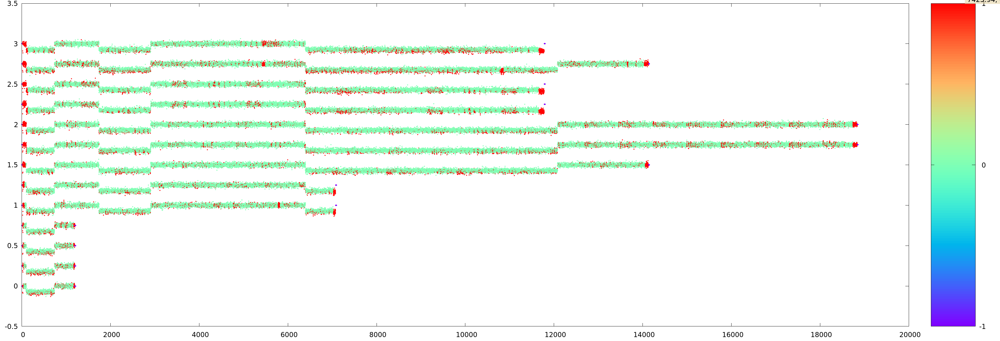

T-48h
-----
The blocks look kinda weird. It's almost as if it's a human trying to imitate someone with non-human intelligence. Why is `ap` in Polish Notation, but `=` is infix?

T-47h
-----
There is another. Found a secondary carrier at circa 22Hz:

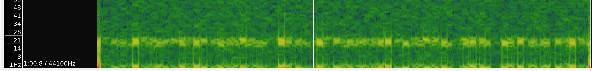

T-40h
-----
The noise makes weird patterns: https://imgur.com/a/GajeHP6 ...It's almost like the noise is supposed to be a 4-dimensional image or something. Maybe an interference hologram?


T-22h
-----
Assemble the team. What are we going to write? Haskell of course. I did sharpen my numerals to write performant number-processing Haskell if needs be..

T-20h
-----
Maybe the noise and the Pflockingen messages were a false lead after all (? (??? (?????))). Let's get back to blocks and write some utilities for parsing them (`Blocks.hs` was born).

T-3h
----
A syntax highlighter for 2D arrays of bits is ready:

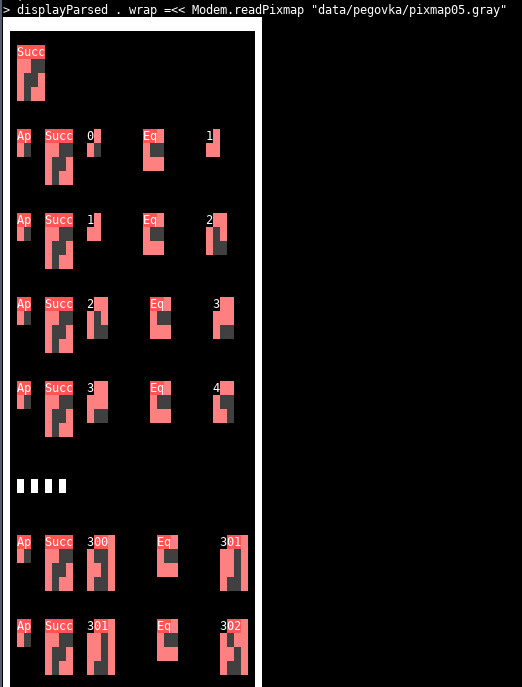

We have this conversation:
> [2:37 PM] savask: I think it's too early to worry about this, maybe all of this won't be useful in the actual task
>
> [2:37 PM] mniip: perhaps
>
> [2:37 PM] mniip: But what if the task description is in the language of ⠋⠀⠋ ⣿⢹⠰⠙⠰⠙⠸⠭⠰⠍ ?

T+0:00
------
New messages arrive. We study them using our sharpened numeral parser.

T+2:00
------
We have an understanding of what all the blocks do (save for the exact implementation of interact and the other symbol... with like... fourfold rotational symmmetry... thing). This looks like some sort of functional language. We're still not sure whether this is purely a combinatory calculus or if lambdas will make appearance later. Partial application is certainly a thing.

T+3:30
------
We have a super-generic rewriting rule system for a mixed combinatory/lamdba calculus. (`Calculus.hs`)

T+7:00
------
The rewrite rules for all the alien operators have been programmed in (`Language.hs`). It can compute powers of two! The galaxy is intractable though... We need a faster interpreter tailored to the needs of the galaxy.

T+9:00
------
`data Closure = Closure (IORef ClosureData)`. There is no going back.

T+12:30
-------
We have a speedy eval/apply graph reduction machine evaluate (`VM.hs`). It can play checkers:

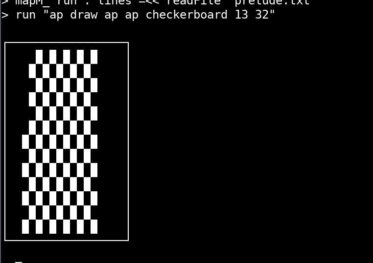

But what was that about interacting with the galaxy?

T+15:00
-------
After lots of troubleshooting of the image drawing routines, we have our first interaction with the galaxy:

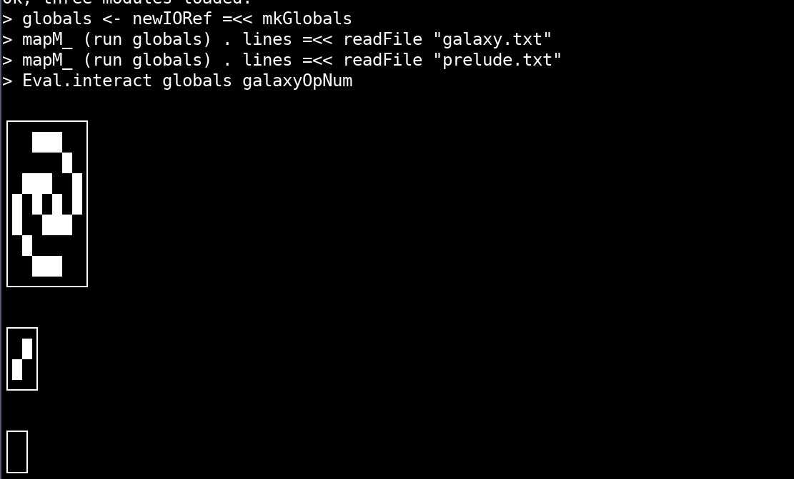

We did not know you're supposed to overlay the images... The crosses made it clear that the coordinates used in the interaction are somehow related to the coordinates on the images. So what we did is make it apparent what each pixel's coordinate is:

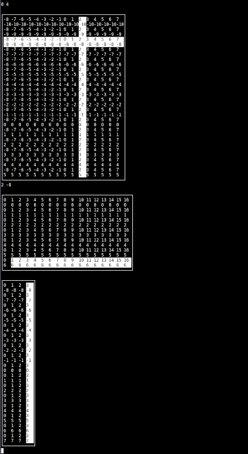

Note how we manually entered the coordinates of the "click" as numbers.
Soon enough we were met with images so big they wouldn't fit in the terminal even on my 4K display:

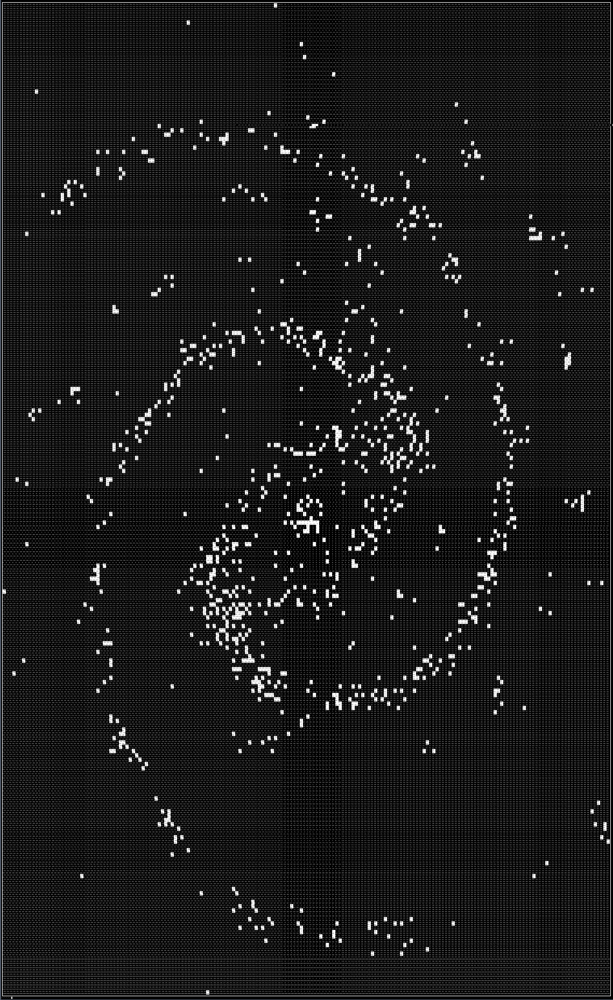

Mysteriously, our VM held up.

T+16:00
-------
It turns out you can click on the different alien pictograms in the galaxy! (Remember that we still don't overlay the images on top of eachother). Oh no what happened to poor Endo!

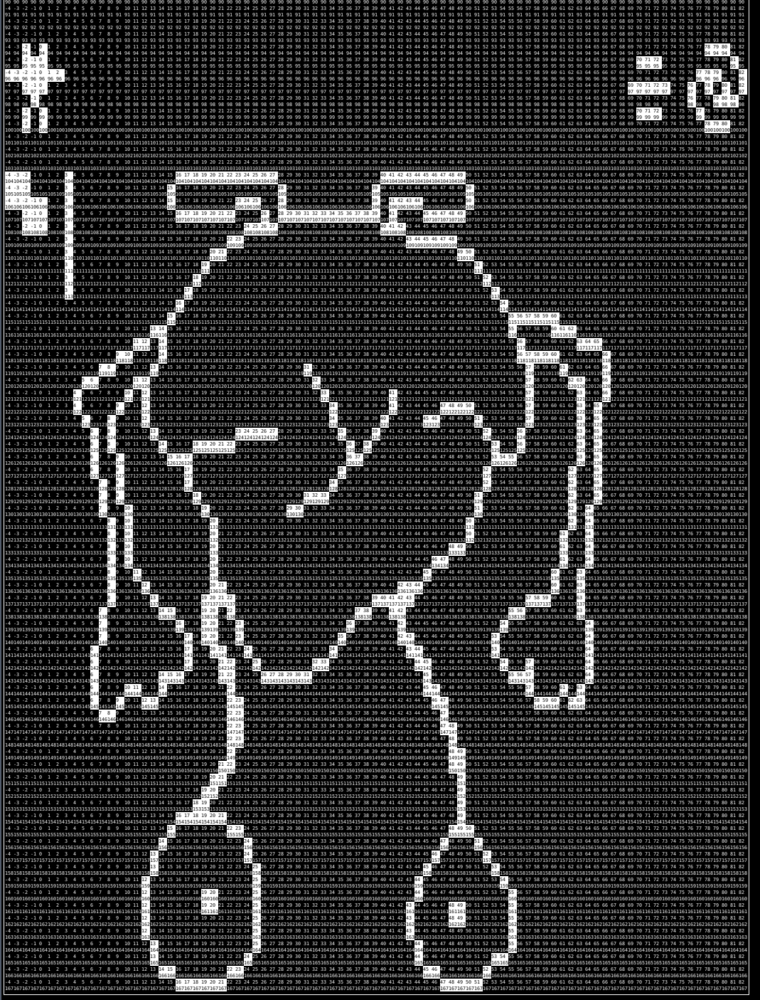

Looks like we've been looking at everything upside down so far? Well, too late to change now.

In the meantime, we start cracking away at the Tic-Tac-Toe and the matching pairs puzzles.

T+16:30
-------
When we enter this screen, the program makes a time request to the alien satellite.
[](writeup_img/interaction4.png)
We stub the code so as to let us manually input the "would-be" satellite response. We play around with the returned time.

Is this a timeline? This point reads 0, must be the present. The point on the far right seems to be at T+72:00!. These pictographs though, they match the ones in the galaxy. Are these different races? Is this showing a timeline of when races have appeared and gone extinct?

We really need a better way of looking at these pictures, like some sort of GUI where you could click on the images!

T+18:30
-------
The TicTacToe puzzle is solved (still completely by typing coordinates). Surely this must mean we are on the leaderboard? ...No... We do notice the "token" that it leaves in the state and we do keep track of it.

T+20:00
-------
We have a simple GUI in C++ and SDL... It's buggy... Shouldn't've used C++...

T+20:45
-------
I lose my temper with the non-working C++ GUI and start writing a GUI in Haskell using Gloss.

T+21:00
-------
We have a Gloss GUI. Can finally click around and see multiple layers overlaid on top of eachother. First time seeing the galaxy in its full beauty:

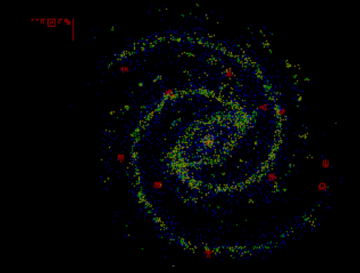

This interface makes a lot more sense now:

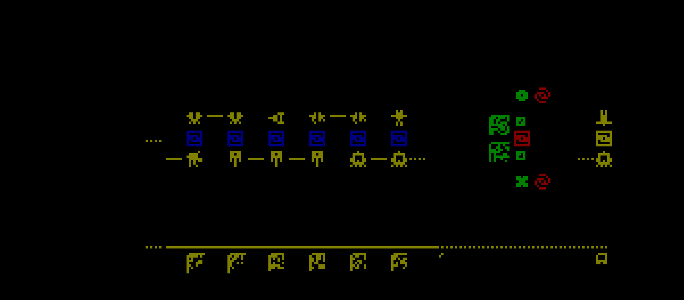

It is also at this point that we removed the stubs and allowed the galaxy to make unaltered calls to the alien satellite. Spoiler: this will become important later.

The organizers were not happy about bending the reality:

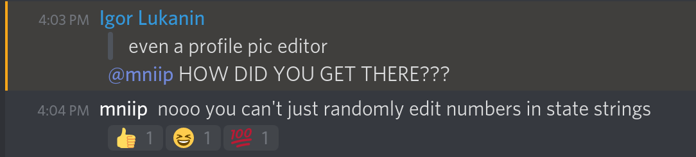

But wait, what's this? Are they fighting? ...No, this can't be!

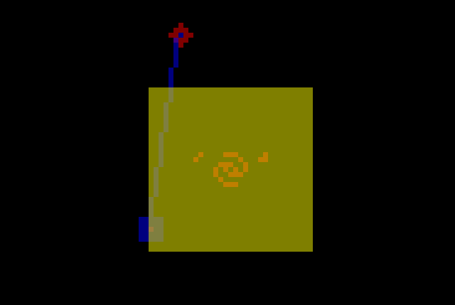

T+21:20
-------
After watching all the "replays", we try out the "x0" button. Thinking it's a yet another replay we start skipping time and proceed to a different stage (?). We mess around a lot without really understanding what we're doing, and suddenly someone notices that we have points on the leaderboard! Sneaky galaxy has sent some requests to the alien proxy!
> [1:18 PM] mniip: I uhh
>
> [1:18 PM] mniip: we're 2nd place
>
> [1:19 PM] mniip: and I have no idea what I've done

Shortly we figured out that these were in fact tutorials for this "space combat". Does that mean that the timeline we've seen was the timeline of some galactic tournament? We proceeded learning how to play the "game" and how to beat the tutorial levels.

T+22:00
-------
We've completed the first 4 tutorials and are struck on the 5th (just like the galaxy combinator people!). Some sort of boost feathering mechanics eh? It is at this point that we realized what the TicTacToe "token" did: allowing you to use 2x the boost per turn!

With this new knowledge (I think (?)) we go even further beyond! Besides we notice that completing past tutorials with more time left gives us better score so we go back and improve our standings.

T+23:45
-------
We solved the matching pairs puzzle, still unsure what it gives us. Computers? Nah, this is mathematicians at work:

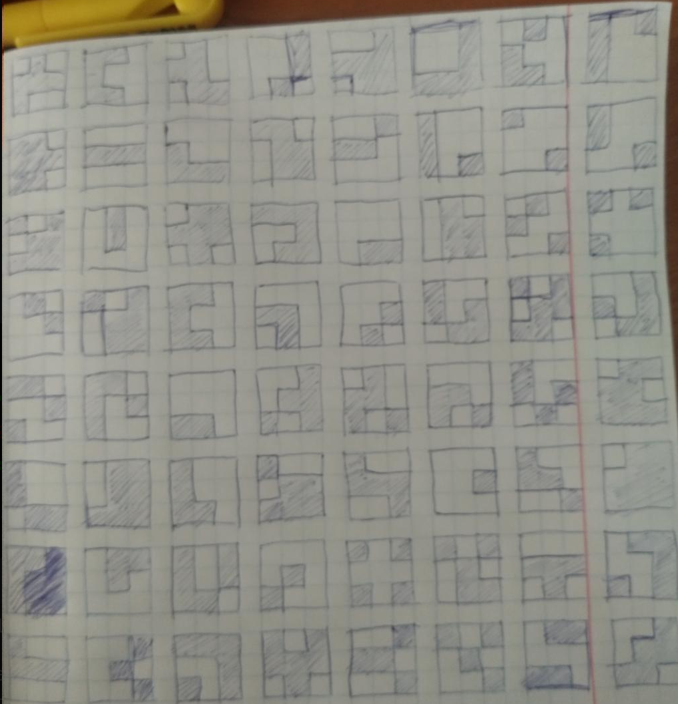

T+24:00
-------
The leaderboard is now frozen, we have completed [REDACTED] tutorials (8 as of leaderboard freeze). Are galaxy combinator people still stuck on #5?

> [4:09 PM] gltronred: Our team of two players tries to write an ad-hoc poorly specified, bug-ridden, slow implementation of half of GHC
>
> [4:10 PM] calm: Gladly we had insane enough people who wrote GHC in a language that's not really fit for it. Good news is that it didn't get us anywhere.
>
> [4:15 PM] mniip: [...] I'd say we have a pretty solid implementation of the GHC RTS in haskell :catThink: [Referring to VM.hs]

That gave me an idea...

T+34:30
-------
We continued attacking the tutorial levels, while also figuring out the exact mechanics of space fights. We tried to come up with names for the 4 ship stats:
  - The first one looks like it's depleted when you are hit... Must be hitpoints!
  - The second one seems to be required for your ranged weapon to do anything... Mana!
  - The third one... We have no idea. Didn't seem to do anything we could observe... Let's call it... I don't know, charisma?
  - The fourth one is super tricky. It's the thing that lets you split your ship into parts that are semantically equivalent, but you can distribute your stats between the two ships. And every ship needs at least 1 of this fourth stat. So it's limiting the number of parts you can divide into. We decided to call the process "mitosis" and the stat -- "telomeres".

At this point the idea that had been planted 10 hours ago, has finally blossomed: why use our own "ad-hoc poorly specified bug-ridden slow" implementation of an eval/apply graph reduction machine, when there's a decent one available right in front of us: the GHC RTS! There's only one obstacle: the GHC RTS will reduce Haskell expressions. The answer is obvious: we need to compile the galaxy to Haskell!

Ok there is another obstacle: we can't create a custom tagged union type for "alien values" that would designate either an integer or something else (a function), because then applying any functions has to go through tons of pattern matching, which would lose all the speed benefits of using the RTS. We really have to use the "builtin" function application process for this to make any sense. This also means that things like `t` or `cons` cannot be "data" and must be functions, because they get applied to arguments sometimes.

We assume that the galaxy code knows what it's doing with respect to types (after all, it hadn't crashed yet), so we just `unsafeCoerce` any and all "alien" values, so that we can mix integers and functions freely. Those two types of "thing" turn out to be all we need to run the galaxy. The ultimate problem then becomes: how does something like `mod` (modulate) detect whether it's been applied to an integer or to a function? This is where the arcane parts of the GHC RTS come into play. We didn't use a tagged union to store whether something is a function or an integer, but the RTS does that for us anyway! All objects are closures, and closures have tag indicating what's inside, and integers have a tag of "data constructor", while functions have a tag of "function", and we can read this tag with a simple spell called `unpackClosure#`, and another spell called `indexWord32OffAddr#` (see `Alien.FFI.isData`).

T+36:00
-------
The galaxy has been compiled to haskell and it works (`Alien/Prelude.hs`, `Alien/Galaxy.hs`, `Alien/FFI.hs`)! Though we don't yet have a GUI for it as the previous GUI was very strongly wired in into the VM.

T+38:00
-------
The new GUI is out, with more fancy features and much faster overall.

It kinda goes downhill from there though. At this point it became clear that we need to write an AI for these space battles. We were completely overwhelmed by the amount and complexity of mechanics we had to reverse-engineer. We also had to reverse engineer the protocol. And that left very little time to actually come up with strategies, and to write and debug code that implements these strategies. (Let alone, we aren't that great at optimal control problems in general.) The summary of our progress goes:

T+44:00
-------
We have reverse engineered most of the interaction protocol, gravity, movement, some of the heating mechanics, how laser damage depends on angle, and some idea of how explosion damage works.

T+49:30
-------
Our AI can hover in place...

T+51:30
-------
We now have a stub submission into which different AIs can be plugged. Our AI can now fall towards the planet and *miss* (also known as orbiting).

T+52:30
-------
Our AI can shoot other ships. We do zero damage though because we haven't yet learned how damage scales with distance, and how heat mechanics work.

T+54:00
-------
Our AI tries to manage its own heat to save up for a burst and shoot, and also can split into a few parts.

T+60:30
-------
We have reverse engineered pretty much all the mechanics (oddly enough, laser stregth depending on distance was the last). Since we can write a (near) prefect simulator, maybe we can write a Monte Carlo Tree Search algorithm that will find the optimal control strategy?

T+68:30
-------
We have an MCTS solver but we do not yet have a simulator... Sometime around this point we realize that an unbeatable strategy for the defender is to split into a debris field. We start working on that as a last resort. We realize that the MCTS approach is hopeless.

T+71:50
-------
We submit our last resort implementation: when defending it will split into a debris field using a minimal amount of fuel, and when attacking it will try to orbit; gauge distance, angle, and own heat for a shot; and will actively try to set up intercepts with enemies. All very ad-hoc and not very well tested.

T+72:00
-------
The leaderboard is closed with us at the 21th place. We wonder whether maybe our last submission miraculously lifted us to 20th place? (Spoiler: it did not.)

Closing thoughts
================
I was absolutely stoked and hyped from the first part of the contest: deciphering an alien functional programming language and efficiently implementing it in a VM. Personally I have been always fascinated by the 2006 ICFPC (cult of the bound variable, UMIX), despite only starting to participate in ICFPCs long after that was over. This year's contest was absolutely on par with that. However maybe the organizers overdid it this year juuust a little bit, given how few teams made significant progress, even given hints from organizers.

On the other hand many people complained about the hints, saying it devalued their team's work on deciphering things themselves. This I disagree with. The challenge is in deciphering things ahead of the clock, and ahead of other teams.
